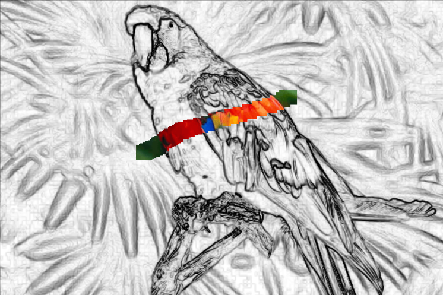
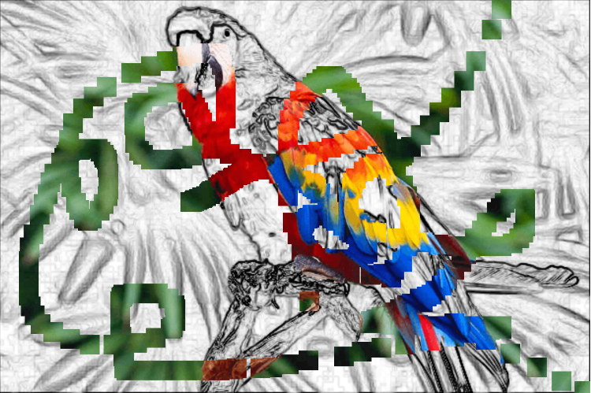
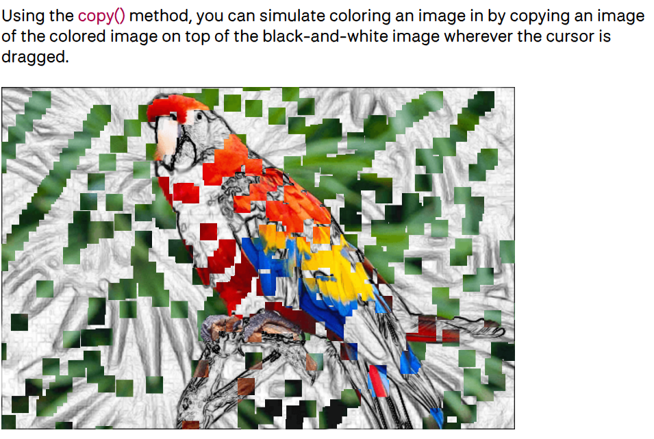

# jini0629_9103_tut1_Quiz8

## Part 1: 

For this assignment, I was inspired by a sketch-to-color transformation technique seen in interactive artworks and educational tools. The technique begins with a black-and-white sketch of a parrot, and users can "paint" over the sketch to reveal the underlying color version by dragging the mouse. This dynamic transformation enhances viewer engagement and visual storytelling.

### Example Screenshots

  
*Initial sketch with partial color revealed*

  
*Progressive color fill with user interaction*

---

## Part 2: 

Using the `copy()` method in p5.js, this technique enables interactive image coloring by copying pixels from a color image (`bottomImg`) onto a black-and-white one (`topImg`) wherever the mouse is dragged. This simulates a "painting" effect and allows users to actively participate in the visual reveal, making the experience engaging and playful.

### Screenshot

### Code Example

Here’s a working implementation from the official p5.js examples:  
 [Click here to view the p5.js example](https://p5js.org/examples/imported-media-copy-image-data/)
